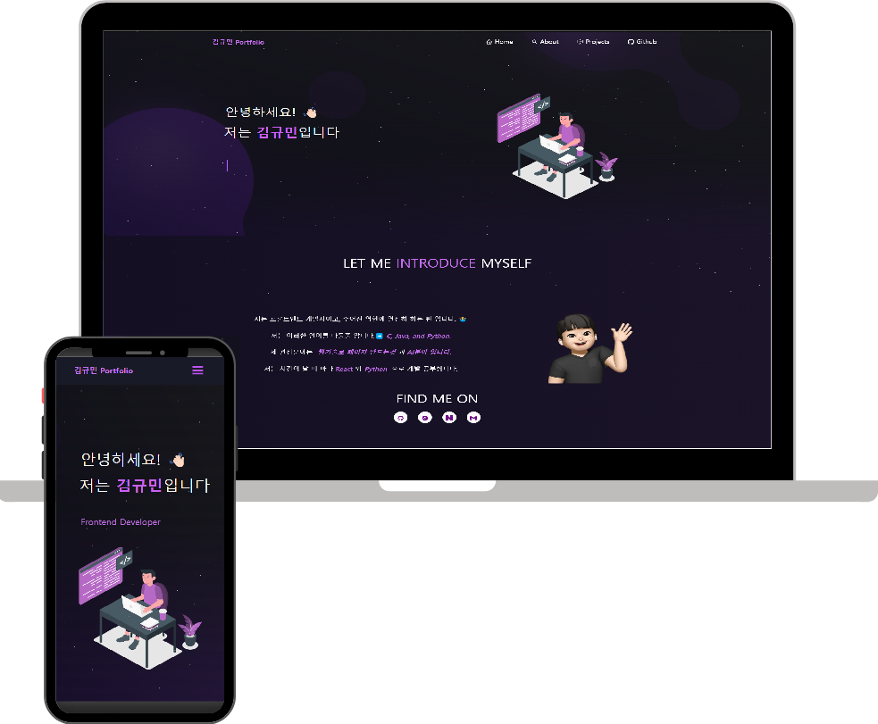

<h2 align="center">
  Portfolio Website - v2.0 
  <a href="http://react-portfolio-kappa-two.vercel.app/" target="_blank">김규민 포트폴리오</a>
</h2>

  

 

## 📝 프로젝트 소개
안녕하세요! 이 포트폴리오 웹사이트는 제 경력과 프로젝트를 시각적으로 보여주기 위해 제작되었습니다. 💻  
최신 기술을 사용하여 반응형 디자인을 구현하였으며, 사용자가 쉽게 탐색할 수 있도록 UI/UX 디자인에 신경 썼습니다.

---

## 🚀 주요 기능
- **홈 페이지**: 간단한 자기소개 및 주요 기술 소개.
- **프로젝트 페이지**: 제가 참여한 프로젝트를 자세히 소개합니다. 🛠️
- **연락처 폼**: 이메일을 통해 쉽게 연락할 수 있습니다. ✉️

---

## 🛠️ 사용 기술
- **Frontend**: ⚛️ React, 💛 JavaScript, 🖋️ HTML, 🎨 CSS
- **Deployment**: Vercel 🚀
- **Design**: Figma 🎨

---
